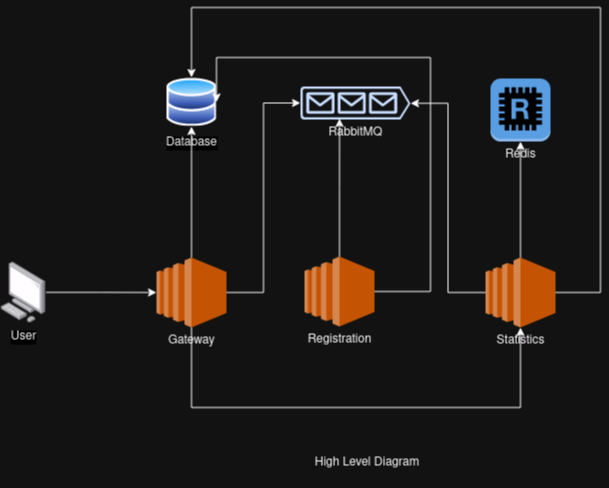

# High Level Architecture


# Running The Project

## Running test

To run all the unit tests and integration tests issue the following command in terminal:
```shell
mvn test
```

## Running with docker compose

To run the project with docker compose issue the following command in terminal
```shell
docker compose up
```

This will spin up all the application along with it's dependencies.

### Accessing the applications

#### Gateway

| Base Url     | http://localhost:8081/gateway                  |
|--------------|------------------------------------------------|
| Health Check | http://localhost:8081/gateway/actuator/health  |
| Metrics      | http://localhost:8081/gateway/actuator/metrics |  |
| Api doc      |      http://localhost:8081/gateway/v3/api-docs                                          |
| Swagger UI   |     http://localhost:8081/gateway/v3/swagger-ui/index.html                                                                                    |

#### Statistics

| Base Url     | http://localhost:8083/statistics |
|--------------|--------|
| Health Check | http://localhost:8083/statistics/actuator/health |
| Metrics      | http://localhost:8083/statistics/actuator/metrics       |  |
| Api doc      | http://localhost:8083/statistics/v3/api-docs |
| Swagger UI   | http://localhost:8083/statistics/v3/swagger-ui/index.html |

### Registration

| Base Url     | http://localhost:8082/registration                |
|--------------|---------------------------------------------------|
| Health Check | http://localhost:8082/registration/actuator/health  |
| Metrics      | http://localhost:8082/registration/actuator/metrics |  |

## Running the project in k8s

If k8s is installed, then run the command to spin upp all the applications along with dependencies:
```shell
kubectl apply -f k8s-manifests 
```

### Accessing the applications
#### Gateway
Run the following command to generate api doc, swagger ui and health check urls for gateway module:
```shell
  kubectl get service/pl-gateway-svc -o jsonpath='Health Check: http://localhost:{.spec.ports[0].nodePort}/gateway/actuator/health{"\n"}Metrics: http://localhost:{.spec.ports[0].nodePort}/gateway/actuator/metrics{"\n"}Swagger Ui: http://localhost:{.spec.ports[0].nodePort}/gateway/v3/swagger-ui{"\n"}Api Doc: http://localhost:{.spec.ports[0].nodePort}/gateway/v3/api-docs{"\n"}'
```
This will produce output like this:
```
Health Check: http://localhost:30534/gateway/actuator/health
Metrics: http://localhost:30534/gateway/actuator/metrics
Swagger Ui: http://localhost:30534/gateway/v3/swagger-ui
Api Doc: http://localhost:30534/gateway/v3/api-docs

```
#### Statistics
Run the following command to generate api doc, swagger ui and health check urls for statistics module:
```shell
  kubectl get service/pl-statistics-svc -o jsonpath='Health Check: http://localhost:{.spec.ports[0].nodePort}/statistics/actuator/health{"\n"}Metrics: http://localhost:{.spec.ports[0].nodePort}/statistics/actuator/metrics{"\n"}Swagger Ui: http://localhost:{.spec.ports[0].nodePort}/statistics/v3/swagger-ui{"\n"}Api Doc: http://localhost:{.spec.ports[0].nodePort}/statistics/v3/api-docs{"\n"}'
```
This will produce output like this:
```
Health Check: http://localhost:30572/statistics/actuator/health
Metrics: http://localhost:30572/statistics/actuator/metrics
Swagger Ui: http://localhost:30572/statistics/v3/swagger-ui
Api Doc: http://localhost:30572/statistics/v3/api-docs
```

#### Registration
Run the following command to generate health check and metrics urls for registration module:
```shell
  kubectl get service/pl-registration-svc -o jsonpath='Health Check: http://localhost:{.spec.ports[0].nodePort}/registration/actuator/health{"\n"}Metrics: http://localhost:{.spec.ports[0].nodePort}/registration/actuator/metrics{"\n"}'
```
This will produce output like this:
```
Health Check: http://localhost:30086/registration/actuator/health
Metrics: http://localhost:30086/registration/actuator/metrics
```